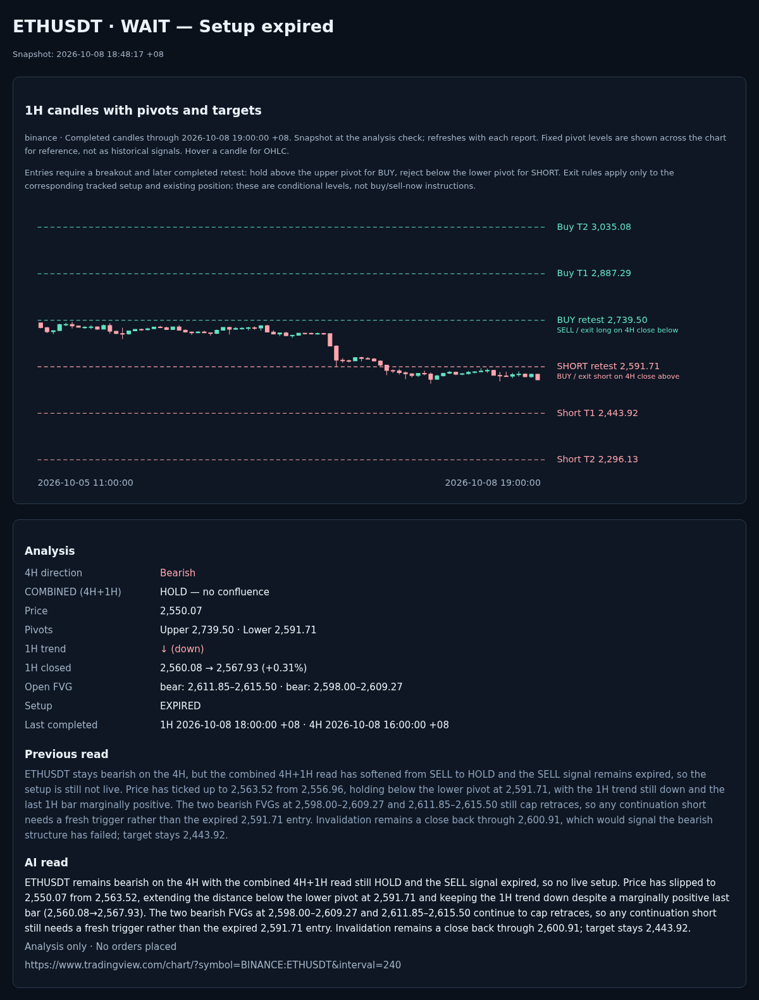

# ETHUSDT · 2026-10-08 18:48:17 +08

**Signal:** ETHUSDT · EXPIRED · 15m · 2,550.07 · —

**4H direction:** Bearish

**COMBINED (4H+1H): HOLD — no confluence**

- Price: 2,550.07
- Upper pivot: 2,739.50 · Lower pivot: 2,591.71
- 1H trend: ↓ (down)
- 1H closed: 2,560.08 → 2,567.93 (+0.31%)
- Open FVG: bear: 2,611.85–2,615.50 · bear: 2,598.00–2,609.27
- Setup: EXPIRED
- Last completed: 1H 2026-10-08 18:00:00 +08 · 4H 2026-10-08 16:00:00 +08

## Previous read

ETHUSDT stays bearish on the 4H, but the combined 4H+1H read has softened from SELL to HOLD and the SELL signal remains expired, so the setup is still not live. Price has ticked up to 2,563.52 from 2,556.96, holding below the lower pivot at 2,591.71, with the 1H trend still down and the last 1H bar marginally positive. The two bearish FVGs at 2,598.00–2,609.27 and 2,611.85–2,615.50 still cap retraces, so any continuation short needs a fresh trigger rather than the expired 2,591.71 entry. Invalidation remains a close back through 2,600.91, which would signal the bearish structure has failed; target stays 2,443.92.

## AI read

ETHUSDT remains bearish on the 4H with the combined 4H+1H read still HOLD and the SELL signal expired, so no live setup. Price has slipped to 2,550.07 from 2,563.52, extending the distance below the lower pivot at 2,591.71 and keeping the 1H trend down despite a marginally positive last bar (2,560.08→2,567.93). The two bearish FVGs at 2,598.00–2,609.27 and 2,611.85–2,615.50 continue to cap retraces, so any continuation short still needs a fresh trigger rather than the expired 2,591.71 entry. Invalidation remains a close back through 2,600.91; target stays 2,443.92.

*Analysis only · No orders placed*

https://www.tradingview.com/chart/?symbol=BINANCE:ETHUSDT&interval=240
