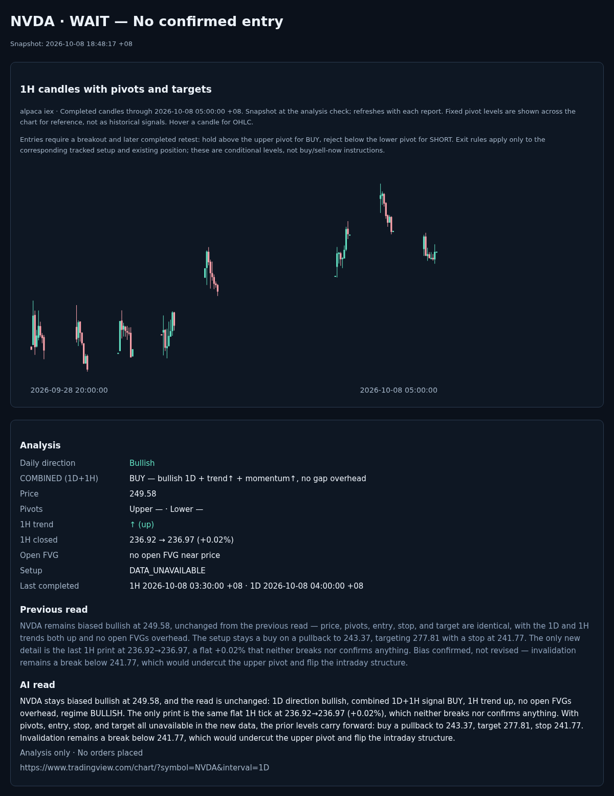

# NVDA · 2026-10-08 18:48:17 +08

**Signal:** NVDA · DATA_UNAVAILABLE · 15m · 249.58 · —

**Daily direction:** Bullish

**COMBINED (1D+1H): BUY — bullish 1D + trend↑ + momentum↑, no gap overhead**

- Price: 249.58
- Upper pivot: — · Lower pivot: —
- 1H trend: ↑ (up)
- 1H closed: 236.92 → 236.97 (+0.02%)
- Open FVG: no open FVG near price
- Setup: DATA_UNAVAILABLE
- Last completed: 1H 2026-10-08 03:30:00 +08 · 1D 2026-10-08 04:00:00 +08

## Previous read

NVDA remains biased bullish at 249.58, unchanged from the previous read — price, pivots, entry, stop, and target are identical, with the 1D and 1H trends both up and no open FVGs overhead. The setup stays a buy on a pullback to 243.37, targeting 277.81 with a stop at 241.77. The only new detail is the last 1H print at 236.92→236.97, a flat +0.02% that neither breaks nor confirms anything. Bias confirmed, not revised — invalidation remains a break below 241.77, which would undercut the upper pivot and flip the intraday structure.

## AI read

NVDA stays biased bullish at 249.58, and the read is unchanged: 1D direction bullish, combined 1D+1H signal BUY, 1H trend up, no open FVGs overhead, regime BULLISH. The only print is the same flat 1H tick at 236.92→236.97 (+0.02%), which neither breaks nor confirms anything. With pivots, entry, stop, and target all unavailable in the new data, the prior levels carry forward: buy a pullback to 243.37, target 277.81, stop 241.77. Invalidation remains a break below 241.77, which would undercut the upper pivot and flip the intraday structure.

*Analysis only · No orders placed*

https://www.tradingview.com/chart/?symbol=NVDA&interval=1D
